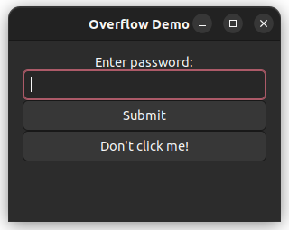

# Security Demonstrations 🔒

This repository contains demonstrations of various security concepts, emphasizing Address Space Layout Randomization (ASLR), stack overflow, and virtual pointer (`vptr`) vulnerabilities.

<p align="center">
  
</p>

---

### Table of Contents 📜

<!-- @import "[TOC]" {cmd="toc" depthFrom=2 depthTo=2 orderedList=false} -->

<!-- code_chunk_output -->

- [1️⃣ ASLR Demonstration](#1️⃣-aslr-demonstration)
- [2️⃣ Stack Overflow Demonstration](#2️⃣-stack-overflow-demonstration)
- [🗑 Cleaning Up](#-cleaning-up)
- [🤝 Contributing](#-contributing)
- [🙏 Acknowledgment](#-acknowledgment)
- [⚠️ Disclaimer](#️-disclaimer)
- [📜 License](#-license)
- [🧮 CIA: Confidentiality, Integrity, and Availability](#-cia-confidentiality-integrity-and-availability)

<!-- /code_chunk_output -->

---

## 1️⃣ ASLR Demonstration

### Overview 📝

ASLR is a computer security technique that randomizes the memory addresses used by processes. This makes it harder for an attacker to predict the location of specific functions or buffers they might target.

### Features ⚙️

- **Toggle ASLR**: The program `aslr_examp` allows you to turn ASLR on or off on a Linux system. This is useful for visualizing the effects of ASLR on memory address allocations.

- **Memory Address Visualization**: The program `print_mem` is a helper utility that prints the memory address of a dynamically allocated variable, demonstrating the effect of enabling or disabling ASLR.

---

### Compilation and Usage 🛠

To compile the ASLR demonstration:

```bash
make aslr_examp print_mem
```

Run the ASLR demo:

```bash
./aslr_examp
```

## 2️⃣ Stack Overflow Demonstration

### Overview 📝

The program `stack_demo` highlights vulnerabilities tied to stack overflow and `vptr` overwrites. By tampering with a class's virtual pointer (`vptr`), it can redirect its virtual function calls, thereby enabling unauthorized access.

### User Input and Overflow 🎛

By default, the program uses a predefined buffer to demonstrate the overflow. But you also have the option to feed data manually or pipe it into the program, even though the default method is easier for demonstration purposes.

### Compilation and Usage 🛠

To compile all the demonstrations at once, simply use:

```bash
make
```

Alternatively, you can use the `Gtk` GUI to compile the programs individually. To do so, run the following command:

```bash
g++ gui.cpp -o gui `pkg-config --cflags --libs gtk+-3.0` -lssl -lcrypto  -w -fno-stack-protector -g -no-pie -g3 -DNO_PIE
```

## 🗑 Cleaning Up

To clean up and remove the compiled binaries:

```bash
make clean
```

## 🤝 Contributing

If you'd like to contribute to this project, please fork the repository and submit a pull request.

## 🙏 Acknowledgment

The code examples in this repository are inspired by and built upon concepts studied in the Open University course "Defensive System-Programming (20937)".

## ⚠️ Disclaimer

The code in this repository is strictly for educational purposes. The demonstrated vulnerabilities aim to raise awareness and understanding of potential security risks. Do not use the code maliciously or without proper understanding. Ensure that you have necessary permissions before making system-level changes, such as modifying ASLR settings.

## 📜 License

This project is open-source and is licensed under the MIT License, which is available in the [LICENSE](LICENSE) file.

---

## 🧮 CIA: Confidentiality, Integrity, and Availability

### Key Concepts: Confidentiality, Integrity, and Availability

From "Modern Operating Systems" by Andrew S. Tanenbaum

- **Confidentiality**: Ensuring information is not disclosed to unauthorized individuals, entities, or processes.

- **Integrity**: Maintaining the accuracy and completeness of information.

- **Availability**: Ensuring information is accessible and usable upon demand by an authorized entity.

### Comparative Analysis Table

| Criteria / Service        | Confidentiality | Integrity | Availability | Example Use Cases                        |
|---------------------------|-----------------|-----------|--------------|------------------------------------------|
| Popular News Services     |        ✘        |     ✔     |      ✔       | Access to news, not typically confidential|
| Backup Storage Systems    |        ✔        |     ✔     |  Moderate    | Secure storage, not always instantly available |
| Banking Services          |        ✔        |     ✔     |      ✔       | High standards for sensitive financial data  |
